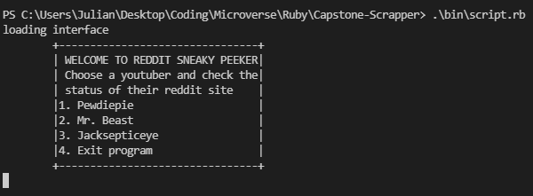
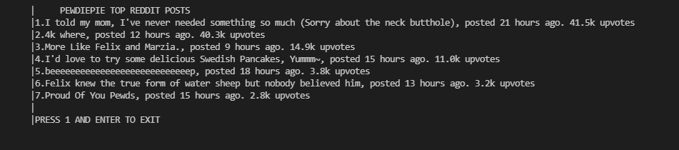

# Reddit Sneaky Peeker

> This application scrapes data from the most known youtubers' reddit.
It is designed to display the most upvoted posts for the day and show you their upvotes and time of upload.




## Built With

- Major languages: 
    - Ruby
    - Gems: OCRA, Nokogiri, Open-uri, Rubocop
- Technologies used:
    - Git Bash/ GitHub
    - VSCode

## Getting Started
To get a local copy up and running follow these simple example steps.

- Clone this repository: Copy the clone link from GitHub and on the git bash run ```git clone 'link'´´´
- Run ```cd Capstone_Scraper´´´ in your console
- Run ```bundle install´´´ in your console
- Run ```bin/script.rb´´´ in your console
- Follow the instructions and choose the content you want to see

If at any point you get an 504 or 502 error in console, don't panic. These errors come from the server during content refresh. Wait a minute and try again.

## Author

👤 **Julian Carracedo**

- GitHub: [@JuliCarracedo](https://github.com/JuliCarracedo)
- Twitter: [@CarracedoJulian](witter.com/CarracedoJulian)
- LinkedIn: [Julian Carracedo](kedin.com/in/julian-carracedo-0b8518207/)

## 🤝 Contributing

Contributions, issues, and feature requests are welcome!

## Show your support

Give a ⭐️ if you like this project!